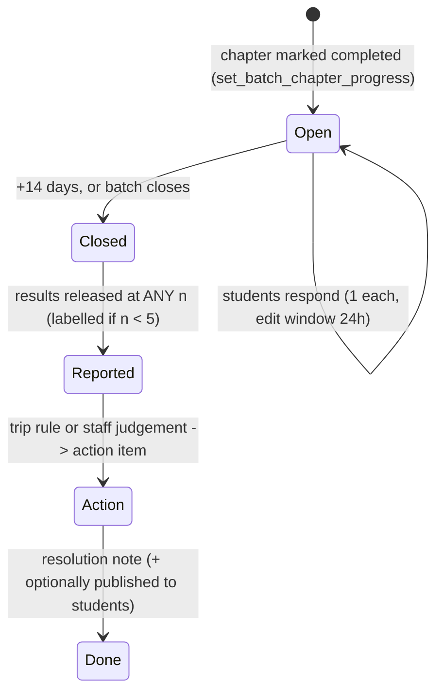

# Post-Chapter Student Feedback — Research & Analysis

**Status:** analysis for product-owner review · **Issue:** [#84](https://github.com/parameshjava/careerlaunchpad/issues/84)
**Next free migration:** `159_*` (highest today is `158_student_question_source.sql`)

> This document does two jobs: (1) validate the eleven bullets in #84 against how
> feedback systems actually behave in practice, and (2) specify the design that fits
> the schema and conventions already shipped.
>
> **STATUS: v1 BUILT (2026-08-03)** — migration `159_chapter_feedback.sql`, the seven
> API routes in §4.6, and the three surfaces in §4.7. Not yet applied to any
> database: CI runs `supabase db push` on merge to `main`. §8 records which decisions
> were taken and which are still open.
>
> **Decisions taken (2026-08-03):**
> - **O-2 — no suppression at low response counts.** One student's feedback is
>   feedback that needs addressing, so every response is shown and triaged at any n;
>   below 5 responses the numbers carry a *Low confidence* label and the raw count,
>   and the trip rule in §4.8 fires on a single response.
> - **Mentor views are anonymous, full stop.** No student name reaches a trainer by
>   any path. Enforced in three places, not one: `mentor_chapter_feedback()` cannot
>   express a per-student row; `chapter_feedback_response` has **no** mentor RLS
>   policy; and `feedback_action_item` shows a mentor only items flagged
>   `published_to_students` — because staff-authored action text is a natural place
>   to name a student ("call Rahul about DI"), and that would have re-introduced
>   identity through a side door.

---

## 1. Scope and what this builds on

#84 asks for post-chapter feedback with rated dimensions, optional remarks,
anonymous trainer visibility, full staff visibility, follow-up with students, and a
staff todo list. Three quarters of the plumbing it needs is already shipped:

| Already in the codebase                                                      | Where                                                     |
| ---------------------------------------------------------------------------- | --------------------------------------------------------- |
| Per-batch chapter list + progress + `completed_at`/`completed_by`            | `batch_chapter`, migration 143                            |
| The exact completion event #84 hangs off                                     | `set_batch_chapter_progress()`, 143 §7c                   |
| Mentor assignment (**several mentors per subject allowed**)                  | `batch_subject_mentor`, 134                               |
| Trainer-facing board to hang a feedback view on                              | `/mentor` → `MentorTeachingBoard`, `/api/mentor/progress` |
| Student-facing hub to hang the prompt on                                     | `/student/quizzes` → `QuizzesHub`                         |
| Learning outcome per chapter (**the thing feedback should be read against**) | `chapter_quiz_attempt`, `student_chapter_quizzes()`       |
| A comment-thread + resolution pattern to copy                                | `student_review_note` (`resolved_at`), 149                |
| A queue + audit + retry notification pattern to copy                         | `exam_result_notification`, 157                           |
| A sensitive-read audit precedent                                             | `impersonation_log`, 101                                  |
| Reference-data convention for option lists                                   | `ref_*` tables (23 of them)                               |

**Not present, and it matters:** there is **no attendance model anywhere** (no
attendance table, no column). Nothing today knows whether a student sat through
the chapter they are being asked to rate. See G1.

Also relevant: `batch_session` / `batch_session_series` (134) model **individual
classes** with Zoom links. So "session" in #84 is genuinely ambiguous — see V3.

---

## 2. What the research says

Ten findings, each with the consequence for our build. Sources in §10.

**F1 — Ratings measure reaction, not learning.** The largest meta-analysis of
multisection studies (Uttl, White & Gonzalez 2017) found student-evaluation ratings
explain **at most ~1%** of variance in learning, and that once small-study effects
are controlled the relationship is not distinguishable from zero. Earlier positive
findings were artifacts of method.
→ *Never* label a feedback average as teaching quality. It is Kirkpatrick Level 1
(reaction). **We already collect Level 2 (learning) — chapter-quiz scores.** Reading
the two together is the single biggest improvement available to us (G6).

**F2 — Ratings carry biases unrelated to teaching.** Expected-grade / grading
leniency is a documented contaminant (Greenwald & Gillmore 1997 — ratings rose even
on items like handwriting legibility and room facilities when students expected
higher grades). Demographic bias has been shown experimentally (MacNell, Driscoll &
Hunt 2015 — the same online instructors rated lower under a female-presenting
identity), though that specific study is contested for its small sample.
→ Don't rank trainers against each other; track a trainer's own trend. Keep the
feedback window's relation to assessment results deliberate (O-5). Separate what is
being rated (F4/G4) so unrelated factors don't land on the trainer.

**F3 — Small samples are unreliable *and* identifying.** Institutional practice
converges on a minimum-response threshold before anything is released: Queensland
**5** (no numbers *or* comments below it), Georgia **6**, Boston University **4**,
Tufts **3–4**; Queensland's reports carry quantitative results only, comments
withheld. With a 12-student batch, per-response rows plus timestamps re-identify
trivially (k-anonymity, Sweeney 2002).
→ **Owner decision (superseding the practice above): nothing is withheld for low
n.** One student's feedback is still feedback that needs addressing. So the
threshold becomes a **reading aid, not a gate**: below 5 responses the numbers are
labelled *Low confidence · n responses* and the percentage is shown beside the raw
count (`3 of 22`), never as a bare "79%". The privacy work the threshold used to do
is carried instead by the measures in V7 — no identity, no timestamps, shuffled
order, moderation before release — which hold at any n.

**F4 — Non-response is the main data-quality risk, and fatigue drives it.** Adams &
Umbach (2012), across ~135,000 evaluations, found participation predicted by
salience and survey fatigue.
→ One short form, throttled; ask at the moment the student is already engaged
(assessment unlock); and **always display the response rate next to the score**, so
"4.6 from 3 of 40" can't be read as "4.6".

**F5 — Coercion destroys the data.** Satisficing theory (Krosnick 1991) predicts
exactly what hard gates produce: straightlining, mid-point spam, fastest-path
answers.
→ The prompt is skippable with "remind me later". Never block the assessment. Flag
straightlined and implausibly fast submissions rather than trusting them.

**F6 — Closing the loop is what makes the next round work.** Students who never see
a change stop answering; visible change is the standard remedy in course-evaluation
practice.
→ #84's todo list is the most valuable bullet in the issue — provided some of it
becomes **visible back to students** (V10/V11).

**F7 — "Anonymous" is a design property, not a checkbox.** Anonymity (nobody can
link response→student) and confidentiality (someone can, and is trusted not to
misuse it) are different promises. #84 asks for confidentiality but calls it
anonymity, and then asks staff to contact the author (V9).
→ State the real promise to the student at the point of submission: *your trainer
sees only combined results; academic staff can see your name.* An overstated promise
that later breaks costs more than the honest one.

**F8 — Item and report design.** Standard, low-risk choices: 5-point unipolar
agreement, one construct per item, ≤6 items plus one optional remark, an explicit
N/A. Report **top-2-box (% rating 4–5) plus the distribution**, not the mean alone —
a mean over an ordinal scale with n=6 invites over-reading.

**F9 — The instrument must be versioned.** Editing a dimension's wording silently
breaks every trend that crosses the edit.
→ `feedback_form` + `feedback_form_item` with a version; answers reference the
**item id**, not a free-floating key.

**F10 — Goodhart's law is well documented here.** Where evaluations feed pay or
renewal, the literature finds grade inflation and incentive distortion, not better
teaching.
→ v1 is explicitly **developmental use only**. Worth writing into the doc so it
isn't quietly repurposed in six months.

---

## 3. Validating #84, bullet by bullet

| #   | #84's thought                                             | Verdict                               | Notes                                                                                                                                                                                                                                                                                                                                                                                                                                      |
| --- | --------------------------------------------------------- | ------------------------------------- | ------------------------------------------------------------------------------------------------------------------------------------------------------------------------------------------------------------------------------------------------------------------------------------------------------------------------------------------------------------------------------------------------------------------------------------------ |
| V1  | Trainer teaches chapter by chapter for a subject          | **Valid — already modelled**          | `batch_chapter` (143). No change.                                                                                                                                                                                                                                                                                                                                                                                                          |
| V2  | Trainer or support marks the chapter complete             | **Valid — already shipped**           | `set_batch_chapter_progress()`; mentor gated by `batch_subject_mentor`, staff by `batch.progress.manage`. Feedback hooks here.                                                                                                                                                                                                                                                                                                             |
| V3  | "Then allow students to give feedback **on the session**" | **Ambiguous — decide**                | Title says *chapter*, body says *session*, and `batch_session` is a real, different table (one class). Chapter-level = 1 form per chapter, low fatigue, but rates something taught over several weeks (recall decay). Session-level = fresh but ~10× the prompts → F4 kills it. **Proposed: chapter-level in v1**; per-session only as an opt-in probe for a chapter already flagged (v3).                                                 |
| V4  | Multiple dimensions, each max 5                           | **Valid — refine**                    | Keep 5-point. Add: ≤6 items, unipolar, one construct each, explicit N/A, **grouped by what is being rated** (trainer / content / logistics — G4), sourced from tables not hard-coded in JSX (CLAUDE.md), and **versioned** (F9).                                                                                                                                                                                                           |
| V5  | Students choose ratings as desired                        | **Valid — one gap**                   | Distinguish "3 = neutral" from "didn't answer". Proposal: rating items required to submit, N/A available per item, and the *whole form* skippable. Silence is then measurable non-response, not a fake 3.                                                                                                                                                                                                                                  |
| V6  | Optional remarks textarea                                 | **Valid — needs guards**              | Free text is the main re-identification vector (F3) and the only abuse/PII surface. Needs a length cap, a moderation/flag state, and staff-first visibility (O-3).                                                                                                                                                                                                                                                                         |
| V7  | Trainer views feedback anonymously                        | **Valid but insufficient as written** | "No name attached" is not anonymity at n=2, and (owner decision) low-n results are **not** withheld — so the protection has to come from the shape of the view instead: aggregates + shuffled remarks only (never a per-response list), no identity, no timestamps, no submission order, moderation before release, and release only after the window closes.                                                                                                                                                                                                                                              |
| V8  | Staff / admin / owner see complete feedback               | **Valid — scope it**                  | Platform admin + owner: unrestricted. `college_admin`: their college only, via `has_college_permission` (established pattern). Identified reads should be logged (`impersonation_log` precedent) — cheap now, unbuyable later.                                                                                                                                                                                                             |
| V9  | Trainer or staff contacts students about negative reviews | **⚠ Conflicts with V7**               | Contacting the author of an "anonymous" response breaks the promise the student was given, and word travels through a batch fast. Proposed fix: a per-response student opt-in — *"I'm happy to be contacted about this"*. Only opted-in responses become contactable, **and only to staff**; the trainer never receives a name. Everyone else gets cohort-level follow-up ("several of you said the pace was fast — here's what changes"). |
| V10 | Staff/admin add a todo list to improve the experience     | **Valid — highest leverage**          | Improve from a flat list: link each action to its **source** (batch/subject/chapter/dimension/response), plus owner, priority, due date, status. And **auto-propose** an action when a threshold trips, so triage doesn't depend on someone remembering to look.                                                                                                                                                                           |
| V11 | Todo can be marked complete later                         | **Valid — extend**                    | Add a resolution note, an aging view (open > N days), and an optional **"publish to students"** flag so closing an action closes the loop (F6).                                                                                                                                                                                                                                                                                            |

### Gaps #84 doesn't cover

| #   | Gap                                                                                                            | Proposal                                                                                                                                                                                                                                                                                                                                                                                   |
| --- | -------------------------------------------------------------------------------------------------------------- | ------------------------------------------------------------------------------------------------------------------------------------------------------------------------------------------------------------------------------------------------------------------------------------------------------------------------------------------------------------------------------------------ |
| G1  | **Eligibility.** No attendance model exists, so a student who never attended can rate the chapter.             | v1: any enrolled (`pending`/`active`) student may respond; record the limitation openly. Add one self-declared screening item ("How much of this chapter did you attend?") and report it beside the scores. Real attendance is a separate feature.                                                                                                                                         |
| G2  | **Window & expiry.** "Then allow feedback" has no end.                                                         | Open on completion, close after **14 days** or at batch close, whichever first. Expired = counted non-response, which is what makes response rate honest. Chapter reverted `completed → in_progress`? Keep responses, reopen the window on re-completion (mirrors 143's "attempts are retained" rule).                                                                                     |
| G3  | **Being asked at all.**                                                                                        | In-app prompt on `/student/quizzes` (v1) + **at most one** email reminder (v2). Note: students are currently notification *subjects*, not recipients (EMAIL_NOTIFICATIONS_SPEC §4) — only #77's result email breaks that. A reminder email is a new student-facing sender and wants 157's queue+retry pattern.                                                                             |
| G4  | **Attribution.** A dropped Zoom call is not bad teaching.                                                      | Three item groups — **Teaching**, **Content & material**, **Logistics/platform** — reported separately. Never one composite "trainer score".                                                                                                                                                                                                                                               |
| G5  | **Multi-mentor chapters.** `batch_subject_mentor` allows several mentors per subject; #84 assumes one trainer. | Feedback is about the **(batch, subject, chapter)**, not a named person. Snapshot who was assigned at open time for context; don't attribute a score to an individual when two people taught.                                                                                                                                                                                              |
| G6  | **Triangulation — the differentiator.**                                                                        | Show each chapter's feedback next to its **quiz pass rate and mean score** from `student_chapter_quizzes`. "Clarity 4.4, pass rate 38%" and "clarity 2.9, pass rate 85%" need opposite responses, and reaction data alone can't tell them apart (F1). No competitor of ours has both halves in one schema; we do, today.                                                                   |
| G7  | **Right of reply.**                                                                                            | Let the trainer attach a context note to a chapter's feedback ("two classes lost to holidays"). Costs one table column, buys trust in the whole mechanism.                                                                                                                                                                                                                                 |
| G8  | **Legal / retention.**                                                                                         | India's DPDP Act 2023 (Rules 2025): purpose limitation, and **under-18 students are "children"** needing verifiable parental consent, with tracking/profiling of children prohibited. Feedback text is also personal data *about the trainer*. Needs a stated purpose at the point of collection, a retention period, and a decision on whether under-18 students are asked at all (O-11). |
| G9  | **Reporting math.**                                                                                            | Top-2-box % + distribution + response rate + n + trend. Always show the raw count next to the percentage; label below n=5 rather than hiding. Never a league table.                                                                                                                                                                                                                                                                                            |

---

## 4. Proposed v1 design

### 4.1 Lifecycle



### 4.2 The instrument (6 items + 1 remark, ~45 seconds)

| Group     | Key          | Prompt (5 = strongly agree)                                                           |
| --------- | ------------ | ------------------------------------------------------------------------------------- |
| Teaching  | `clarity`    | The trainer explained this chapter's concepts clearly.                                |
| Teaching  | `pace`       | The pace of this chapter suited me.                                                   |
| Teaching  | `doubts`     | My questions and doubts were addressed.                                               |
| Content   | `material`   | The notes / examples / practice were useful.                                          |
| Content   | `confidence` | I feel ready to attempt questions from this chapter.                                  |
| Logistics | `logistics`  | Class timing, audio/video and joining worked fine.                                    |
| —         | `attended`   | *Screening (G1):* how much of this chapter did you attend? (all / most / some / none) |
| —         | `remark`     | Optional: anything you'd like us to know or change.                                   |

`confidence` is deliberately self-efficacy, not satisfaction — it is the item that
pairs most directly with the chapter's quiz outcome (G6).

### 4.3 Data model (migration 159)

```
feedback_form              -- versioned instrument (F9)
  id, scope 'chapter', version int, status draft|active|retired, published_at, created_by
feedback_form_item
  id, form_id, dimension_key, prompt, item_group teaching|content|logistics|screening,
  sort_order, response_type rating5|choice|text, required bool, allow_na bool

chapter_feedback_request   -- one per chapter completion; the response-rate denominator
  id, batch_id, subject_id, chapter_id, form_id,
  opened_at, closes_at, status open|closed,
  eligible_count int,          -- enrolled students at open time
  mentor_snapshot text[],      -- who was assigned then (G5)
  mentor_note text,            -- right of reply (G7)
  unique (batch_id, subject_id, chapter_id, opened_at)

chapter_feedback_response
  id, request_id, student_id, submitted_at, remark text,
  contact_ok bool default false,        -- V9 opt-in
  quality_flag text null,               -- straightlined | too_fast | flagged_text (F5/V6)
  moderation text default 'pending',    -- pending | ok | hidden
  unique (request_id, student_id)

chapter_feedback_answer
  response_id, item_id, rating smallint null check (rating between 1 and 5),
  choice text null, primary key (response_id, item_id)

feedback_action_item        -- V10/V11, upgraded
  id, batch_id, subject_id null, chapter_id null, request_id null, dimension_key null,
  title, detail, owner_user_id, priority, due_on,
  status open|in_progress|done|dropped, resolution_note,
  published_to_students bool default false,
  created_by, created_at, updated_at, completed_at, completed_by
```

`chapter_feedback_request` is the load-bearing table: without it there is no
denominator, so "response rate" and "non-response" are unmeasurable — and F4 says
that is the number that keeps every score honest.

### 4.4 Permissions (new keys, seeded in 159)

| Key                        | Held by                                                              | Grants                                       |
| -------------------------- | -------------------------------------------------------------------- | -------------------------------------------- |
| `feedback.submit`          | `student`                                                            | Submit a response to an open request.        |
| `feedback.view.identified` | `platform_admin`, `coordinator`, `support`, `college_admin` (scoped) | Per-response rows **with** student identity. |
| `feedback.action.manage`   | `platform_admin`, `coordinator`, `support`                           | Create/own/close action items.               |
| `feedback.form.manage`     | `platform_admin` (owner via `*`)                                     | Publish a new form version.                  |

Mentors get **no** permission key — like chapter progress, they're gated by their
`batch_subject_mentor` assignment inside the RPC.

### 4.5 Visibility matrix (enforced in SQL)

|                            | Own response    | Aggregates               | Per-response rows | Identity      | Remarks                                    | Contact student   |
| -------------------------- | --------------- | ------------------------ | ----------------- | ------------- | ------------------------------------------ | ----------------- |
| **Student**                | ✅ read/edit 24h | ❌                        | ❌                 | ❌             | own only                                   | —                 |
| **Mentor (assigned)**      | —               | ✅ after close, **any n** (labelled below 5) | ❌                 | ❌             | ✅ moderated, order-shuffled, no timestamps | ❌ never           |
| **Support / coordinator**  | —               | ✅ any n                  | ✅                 | ✅             | ✅                                          | ✅ if `contact_ok` |
| **College admin**          | —               | ✅ own college            | ✅ own college     | ✅ own college | ✅                                          | ✅ if `contact_ok` |
| **Platform admin / owner** | —               | ✅                        | ✅                 | ✅             | ✅                                          | ✅ if `contact_ok` |

All of it through `SECURITY DEFINER` RPCs — the identity-stripping, the shuffle and
the timestamp-stripping are properties of the function, not of a component that a
future refactor can drop. (The mentor RPC returns aggregates and remark text only;
there is no shape in which it can return a per-student row.)

### 4.6 API sketch (API-design-first, per CLAUDE.md)

```
GET   /api/student/feedback/pending                 -> { requests: [{ requestId, chapterName, subjectName, closesAt, items:[…] }] }
POST  /api/student/feedback/[requestId]              body { answers:[{itemId, rating|choice}], remark?, contact_ok? } -> { ok }
GET   /api/student/feedback/[requestId]              -> own submitted response (round-trip, 24h edit)
GET   /api/mentor/feedback                           -> { chapters: [{ …, n, eligible, topTwoBox{…}, distribution{…}, remarks[], quizPassPct, lowConfidence }] }
POST  /api/mentor/feedback/[requestId]/note          body { note } -> { ok }            (G7)
GET   /api/admin/batches/[id]/feedback               -> full detail incl. identity + non-responders
GET   /api/admin/feedback/actions                    -> { actions: [...] }  (filters: batch, status, overdue)
POST  /api/admin/feedback/actions                    -> create
PATCH /api/admin/feedback/actions/[id]               -> status / owner / due / resolution_note / published_to_students
```

### 4.7 UX surfaces (mobile-first, ~320px first)

- **Student** — a dismissible card at the top of `/student/quizzes` above that
  chapter's assessment card: *"How was **Quadratic Equations**? 45 seconds."* Six
  radio rows, one textarea, submit. Skippable; "remind me later" re-shows in 3 days.
  The visibility promise (F7) sits right above the submit button, not in a footer.
- **Mentor** — a "Feedback" section per subject on `/mentor`, alongside the existing
  teaching board: per chapter, top-2-box bars per group, n / eligible, the chapter's
  quiz pass rate beside it (G6), remarks below, "Add context" for the note.
- **Staff** — `/dashboard/batches/[id]` → **Feedback** tab (existing tab pattern),
  plus an **Actions** list with an overdue count in the trigger, per STYLE_GUIDE.

### 4.8 Definitions (write these down once, use everywhere)

- **Response rate** = responses ÷ `eligible_count` at open time.
- **Top-2-box** = ratings of 4 or 5 ÷ non-N/A ratings for that item.
- **Low confidence** = fewer than **5** responses. Everything is still shown, to
  everyone entitled to see it; the label and the raw count are what change. There is
  no suppressed state (owner decision, F3).
- **Trend** = a trainer's own successive chapters. Never cross-trainer ranking (F2/F10).
- **Trip rule** (what earns triage — deliberately n-independent, so a single
  response is never ignored):
  1. any single answer of **1 or 2** on a Teaching or Content item, **or**
  2. any item's mean **< 3.0**, **or**
  3. any remark at all (a student who typed something wants a reply), **or**
  4. a response rate **< 40%** once the window closes (a silence signal, not a score).
  Any trip proposes an action item (V10) and shows on the staff triage list.

---

## 5. Explicit non-goals for v1

1. No hard gate on any learning content behind the form (F5).
2. No trainer league tables, and no feedback score in pay/renewal decisions (F10).
3. No single composite "trainer rating" (G4).
4. No per-session feedback (F4/V3).
5. No sentiment analysis / LLM summarization of remarks yet — 6 items and a
   textarea over one batch is human-readable; buy the reporting first.
6. No editing a live form version in place (F9).

---

## 6. Success metrics

| Metric                                      | Target                                      |
| ------------------------------------------- | ------------------------------------------- |
| Response rate per chapter request           | ≥ 60% by the third chapter of a batch       |
| Median time to complete                     | ≤ 60s                                       |
| Requests reaching n ≥ 5 (read without a caveat) | ≥ 80% — a quality goal, never a gate    |
| Threshold trips converted to an action item | ≥ 90% within 7 days                         |
| Actions closed with a resolution note       | ≥ 80% within 30 days                        |
| Straightlined / too-fast share              | < 10% (rises → the prompt is being coerced) |

---

## 7. Phasing

- **v1 (migration 159)** — form + request + response + answer + actions; the trigger
  in `set_batch_chapter_progress`; student prompt; mentor aggregate view with k and
  quiz pass rate; staff detail + actions; in-app prompting only.
- **v2** — one reminder email (157's queue/retry pattern); batch- and
  trainer-trend dashboards; "what we changed" published back to students; overdue
  action digest to staff.
- **v3** — per-session probes for flagged chapters; correlation reporting
  (reaction × learning) in analytics; remark clustering.

---

## 8. Decisions

v1 was built on the proposed defaults below. **Every one of them is a config value or
a single-file change, not an architectural commitment** — the window length is one
`interval` in `open_chapter_feedback_request`, the instrument is rows in
`feedback_form_item` (versioned, so changing it doesn't corrupt history), and the
low-confidence threshold is `LOW_CONFIDENCE_BELOW` in `lib/feedback-query.ts` plus one
comparison in SQL. Say the word on any row and it changes.

| #        | Question                                                                               | Status / default as built                                                                    |
| -------- | -------------------------------------------------------------------------------------- | ------------------------------------------------------------------------------------------- |
| **O-1**  | Feedback per **chapter** or per **session** (V3)?                                      | **Built as chapter.** Sessions only as v3 probes.                                            |
| **O-2**  | ~~Suppression threshold **k** for the trainer view?~~                                   | **DECIDED — no suppression.** Every response is shown and addressed at any n; below 5 it is labelled *Low confidence* with the raw count. |
| **O-3**  | Do trainers see **remarks verbatim**, or staff-reviewed first?                         | **Built as verbatim** at any n, minus anything staff set to `moderation='hidden'`. Flip to staff-review-first by defaulting the column to `'pending'` and filtering on `'ok'`. |
| **O-4**  | Resolve the V7/V9 conflict how?                                                        | **Built as `contact_ok` opt-in.** Staff-only outreach; the Contact button renders only for opted-in rows; trainer never gets a name. |
| **O-5**  | Release trainer aggregates **before or after** the chapter's quiz results are visible? | **Built as after close.** While open, the mentor sees the response count and no scores.       |
| **O-6**  | Response window length?                                                                | **Built as 14 days.** One `interval '14 days'` in `open_chapter_feedback_request`.            |
| **O-7**  | Are the six items in §4.2 the right dimensions — anything to add or drop?              | **Built as those six** + the attendance screener. Change by publishing form v2 (§F9).         |
| **O-8**  | Should feedback be **required** to unlock the chapter's assessment?                    | **Built as no gate** (F5). Prompt is skippable, snoozes 3 days locally.                       |
| **O-9**  | Who owns action items by default?                                                      | **Built as the creator** (falls back to `ctx.userId`); reassignable per item.                 |
| **O-10** | Publish "what we changed" back to students?                                            | **Built** — per-action `published_to_students` flag, surfaced on the student hub.             |
| **O-11** | Ask **under-18** students at all, given DPDP consent rules (G8)?                       | **Still open.** Built to ask everyone, with the purpose stated at collection. No age gate.    |
| **O-12** | Retention period for responses and remarks?                                            | **Still open.** Nothing deletes today; needs a cron sweep once you pick a period.             |

---

## 9. Traceability — #84 → this document

| #84 bullet                                                                                                         | Covered by                               |
| ------------------------------------------------------------------------------------------------------------------ | ---------------------------------------- |
| Trainer teaches chapter by chapter                                                                                 | V1, §1 (`batch_chapter`)                 |
| Trainer/support marks chapter complete                                                                             | V2, §4.1 trigger                         |
| Students give feedback after completion                                                                            | V3, O-1, §4.1, §4.7                      |
| Multiple dimensions, max 5 each                                                                                    | V4, §4.2, F8                             |
| Students choose ratings as desired                                                                                 | V5, §4.2                                 |
| Optional remarks                                                                                                   | V6, O-3, §4.3 (`remark`, `moderation`)   |
| Trainer views anonymously                                                                                          | V7, F3/F7, O-2, §4.5                     |
| Staff/admin/owner see complete feedback                                                                            | V8, §4.4, §4.5                           |
| Trainer/staff connects to students on negatives                                                                    | V9, O-4 (**conflict resolved**)          |
| Staff/admin add improvement todos                                                                                  | V10, §4.3 (`feedback_action_item`), §4.8 |
| Todos completed later                                                                                              | V11, §4.1, O-10                          |
| *(not in #84)* eligibility, window, reminders, attribution, quiz triangulation, right of reply, legal, report math | G1–G9                                    |

---

## 10. Sources

- Uttl, White & Gonzalez (2017), *Meta-analysis of faculty's teaching effectiveness: SET ratings and student learning are not related*, Studies in Educational Evaluation 54 — [ScienceDirect](https://www.sciencedirect.com/science/article/abs/pii/S0191491X16300323)
- Greenwald & Gillmore (1997), *Grading leniency is a removable contaminant of student ratings* — [summary](https://www.hendrix.edu/uploadedFiles/Academics/Faculty_Resources/Faculty_Development_Newsletters/Good-teaching-evaluations-bad-teaching(1).pdf)
- MacNell, Driscoll & Hunt (2015), *What's in a Name: Exposing Gender Bias in Student Ratings of Teaching*, Innovative Higher Education 40(4) — [Springer](https://link.springer.com/article/10.1007/s10755-014-9313-4); contested — see [critique](https://www.scienceopen.com/hosted-document?doi=10.14293%2FS2199-1006.1.SOR.2021.0001.v1)
- Adams & Umbach (2012), *Nonresponse and Online Student Evaluations of Teaching*, Research in Higher Education 53(5) — [Springer](https://link.springer.com/article/10.1007/s11162-011-9240-5)
- *SET encourages poor teaching and contributes to grade inflation* (2020), Basic and Applied Social Psychology — [Taylor & Francis](https://www.tandfonline.com/doi/full/10.1080/01973533.2020.1756817)
- Minimum-response thresholds in practice — [UQ (5, incl. comments)](https://policies.uq.edu.au/document/view-current.php?id=230.1.1), [UGA (6)](https://reg.uga.edu/academics/course-evaluations/), [BU (4)](https://www.bu.edu/tech/services/teaching/assessment/course-evaluations/course-evaluation-policies/), [Tufts (3–4)](https://tuftsedtech.screenstepslive.com/s/19028/m/73551/l/831466-are-my-responses-confidential)
- Berk (2012), *Top 20 strategies to increase online response rates* — [PDF](https://apps.weber.edu/wsuimages/ie/Evaluations/Top%2020%20strategies%20to%20increase%20online%20response%20rates.pdf)
- DPDP Act 2023 §9 + DPDP Rules 2025 (child = under 18; verifiable parental consent; no profiling of children) — [§9](https://www.dpdpa.com/dpdpa2023/chapter-2/section9.html), [Rule 10](https://www.dpdpa.com/dpdparules/rule10.html)
- Kirkpatrick four-level training evaluation model (reaction → learning → behaviour → results); Krosnick (1991) on satisficing in surveys; Sweeney (2002) on k-anonymity — standard references, no link needed.
