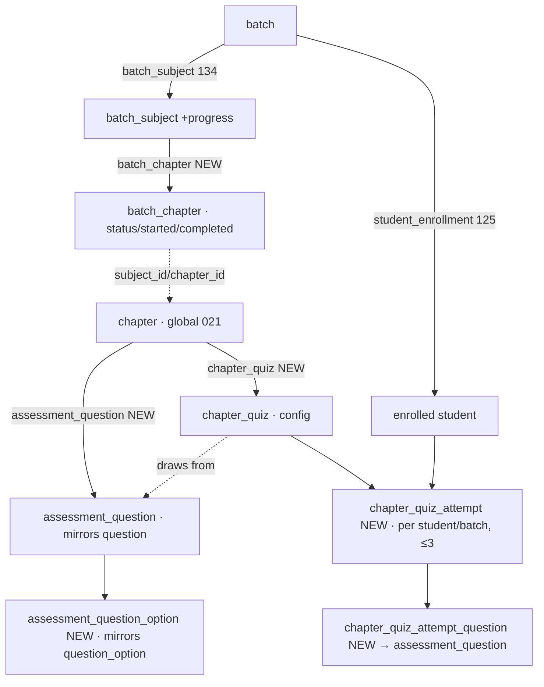

# Chapter Progress Tracking & Per-Chapter Assessments — Requirements

**Status:** draft for review · **Owner:** (tbd) · **Target migration:** `143_*` (highest today is `142_hard_delete_member.sql`)

## 1. Purpose & summary

When a **batch** starts, its **mentors** drive the batch through the syllabus: they
mark **which subject is in progress** and **which chapter is in progress**. When a
chapter's teaching is finished, a **mentor, staff, or admin** marks that **chapter
completed**. Completing a chapter **unlocks a short assessment quiz** for that chapter,
which the batch's enrolled **students take on their own** — up to **3 attempts each**.

This turns the batch from a static roster + calendar into a **living progress board**,
and gives students immediate, chapter-scoped self-assessment as they go.

### What already exists (reused, not rebuilt)

- **`batch`** — a dated run of a `course` (`status`: draft/open/running/closed/cancelled).
- **`batch_subject`** — the subjects a batch teaches, seeded from the course's
  competitive-exam syllabus (migration 134). **This is the anchor we extend.**
- **`batch_subject_mentor`** — the mentor(s) assigned to each subject of a batch.
- **`subject` / `chapter`** — the global taxonomy (migration 021). Chapters are keyed
  by subject; questions in the global bank are keyed by `chapter_id`.
- **`student_enrollment`** — who is in the batch (`status`: pending/active/completed/cancelled).
- **Global question bank** (`question` / `question_option`) — the exam bank; its **schema
  is the template** the new assessment bank copies (per the product decision below).

### What is net-new (this document)

1. **Per-batch chapter list + progress** — a `batch_chapter` table (chapters don't exist
   on a batch today; only subjects do).
2. **Subject-level progress** — a status on `batch_subject`.
3. **A dedicated assessment question bank** — new `assessment_question` /
   `assessment_question_option` tables that **mirror the existing `question` /
   `question_option` schema** (migration 021), keyed by chapter. Assessment questions are
   authored/stored **separately** from the exam bank.
4. **A lightweight, batch-scoped chapter quiz** — separate from the college-scoped exam
   engine (`chapter_quiz` + attempt tables), drawing questions from the **assessment**
   bank above.
5. **Progress + quiz permissions, RLS, RPCs, APIs, and UI** for mentor / staff / student.

> **Decisions locked with the product owner (2026-07-24):**
> **D1 — Assessment is a NEW lightweight, batch-scoped quiz**, parallel to (not part of)
> the exam-blueprint engine. Its questions live in a **new `assessment_question` /
> `assessment_question_option` bank that mirrors the existing `question` / `question_option`
> tables** — same schema, separate data (not the exam bank).
> **D2 — Students self-serve up to 3 attempts** per chapter quiz; no manual "open sitting"
> step by staff — completion makes it available immediately.
> **D3 — Free / any-order progression** — a mentor may set any chapter in progress or
> completed independently; multiple chapters may be in progress; no enforced sequence.

---

## 2. Glossary & actors

| Term | Meaning |
|---|---|
| **Batch** | A dated run of a course; the unit that "starts." |
| **Batch subject** | One subject the batch teaches (`batch_subject`). |
| **Batch chapter** | One chapter of a batch subject, with its own progress (`batch_chapter`, new). |
| **Chapter quiz** | A short, auto-generated assessment for one chapter, taken per batch. |
| **Attempt** | One student sitting of a chapter quiz (max 3 per student per chapter per batch). |

| Actor | Who | What they do here |
|---|---|---|
| **Mentor** | `mentor` role, **assigned** to a subject via `batch_subject_mentor` | Start subject/chapter; mark chapter completed — **only for their assigned subjects**. |
| **Staff** | `support` / `coordinator` roles (holding `batch.progress.manage`) | Start/complete any subject/chapter in any batch. |
| **Admin** | `platform_admin` / `owner` | Same as staff, unrestricted. |
| **Student** | `student` role, enrolled (active/pending) in the batch | Take unlocked chapter quizzes on their own. |

> "Either staff, admin or mentor can mark the chapter completed" (from the requirement)
> maps to: **admin/staff via the `batch.progress.manage` permission**, and **mentors
> gated by their `batch_subject_mentor` assignment** (not a blanket permission).

---

## 3. Functional requirements

### FR-1 — Materialize chapters onto a batch
When a batch's subjects are set/changed (existing `replace_batch_subjects`, migration 135),
the system materializes one `batch_chapter` row per chapter in that subject's syllabus
(from `competitive_exam_subject_chapter` of the course's competitive exams), each starting
at `not_started`. Removing a subject removes its chapters (progress and attempts for that
subject are discarded — guarded like the existing "can't remove a subject with classes" rule).

### FR-2 — Mentor starts a subject / chapter (sets *in progress*)
- An **assigned mentor** (or staff/admin) sets a **subject** to `in_progress` and a
  **chapter** to `in_progress`.
- **Free order (D3):** any chapter may be started; more than one chapter may be
  `in_progress` at once; there is **no** enforced sequence.
- Allowed only while the **batch is `open` or `running`** (not draft/closed/cancelled).

### FR-3 — Mark a chapter completed
- A **mentor** (assigned to that subject), **staff**, or **admin** sets a **chapter** to
  `completed`. Stamps `completed_at` + `completed_by`.
- A subject may be set `completed` too (independent flag; not auto-derived, per D3).
- **Reverting** `completed → in_progress` is allowed for **staff/admin** (audit-stamped);
  existing quiz attempts are **retained**, and the quiz **re-locks** for new attempts.
  *(Open decision O-4: should mentors be able to revert their own completions?)*

### FR-4 — Completing a chapter unlocks its quiz (D2)
- The moment a chapter is `completed`, its **chapter quiz becomes available** to every
  **enrolled (active/pending)** student in that batch — **no manual staff step**.
- If **no active `assessment_question` rows exist** for that chapter, the chapter still
  shows as completed but its quiz shows **"assessment not available yet"** (see O-2).

### FR-5 — Student takes the chapter quiz (self-service, ≤ 3 attempts, D2)
- A student sees each **completed** chapter of their batch with a **"Take assessment"**
  action showing **attempts used (x/3)** and **best score**.
- Starting an attempt generates a fresh question set from the bank for that chapter.
- The student answers, submits, and **immediately sees their score and pass/fail**.
- **Hard cap: 3 attempts** per (student, chapter, batch). The 4th start is refused.
- An in-progress attempt can be **resumed**; abandoning still counts toward the 3.

### FR-6 — Progress visibility
- **Mentor** sees a board of their assigned subjects → chapters with status + controls.
- **Staff/admin** see the full batch board (all subjects, all chapters) on the batch page.
- **Student** sees per-chapter status and, for completed chapters, their quiz + results.

---

## 4. Data model (new)



### 4.1 `batch_subject` — add subject-level progress (ALTER)
```
+ progress_status  text not null default 'not_started'
                   check (progress_status in ('not_started','in_progress','completed'))
+ started_at       timestamptz
+ started_by       uuid references app_user(id)
+ completed_at     timestamptz
+ completed_by     uuid references app_user(id)
```
`replace_batch_subjects` (135) must **not** clobber these on its upsert (it only touches
`subject_name` / `sort_order`).

### 4.2 `batch_chapter` — NEW (per-batch chapter progress)
```
batch_id      uuid  → batch(id) on delete cascade
subject_id    uuid
chapter_id    uuid
chapter_name  text                 -- denormalized (chapter is RLS-locked to exam staff)
sort_order    int  not null default 0   -- display order (chapters have NO native ordering; see O-1)
status        text not null default 'not_started'
                check (status in ('not_started','in_progress','completed'))
started_at    timestamptz
started_by    uuid → app_user(id)
completed_at  timestamptz
completed_by  uuid → app_user(id)
updated_at    timestamptz not null default now()
primary key (batch_id, subject_id, chapter_id)
foreign key (batch_id, subject_id) references batch_subject (batch_id, subject_id) on delete cascade
```
Mirrors how `batch_subject` denormalizes `subject_name` because the taxonomy is RLS-locked.

### 4.3 `assessment_question` / `assessment_question_option` — NEW (dedicated bank)
**Mirror the existing `question` / `question_option` schema (021) exactly** — same columns,
constraints, and composite FK to `chapter` — but hold **assessment** questions, separate
from the exam bank. This is the source the chapter quiz draws from.
```
assessment_question (
  id             uuid pk default gen_random_uuid()
  subject_id     uuid not null                       -- denormalized (as in question)
  chapter_id     uuid not null
  passage_id     uuid → assessment_passage(id)       -- optional; add only if passages needed (O-10)
  kind           text not null default 'standard' check (kind in ('standard','passage','data_sufficiency'))
  difficulty     text not null check (difficulty in ('easy','medium','hard','very_hard'))
  answer_type    text not null check (answer_type in ('single','multi'))
  stem           text not null
  stem_image_url text
  explanation    text
  version        int  not null default 1
  status         text not null default 'active' check (status in ('active','archived'))
  created_by     uuid → app_user(id)
  created_at     timestamptz not null default now()
  updated_at     timestamptz not null default now()
  foreign key (chapter_id, subject_id) references chapter (id, subject_id)
)
assessment_question_option (
  id          uuid pk default gen_random_uuid()
  question_id uuid → assessment_question(id) on delete cascade
  label       text not null
  is_correct  boolean not null default false
  position    int not null
  unique (question_id, position)
)
```
Indexes mirror 021 (`(chapter_id)`, `(subject_id, difficulty, status)`, `(question_id)`).
Managed by exam staff (`exam.question.manage`); authored in a dedicated
`/dashboard/assessment-questions` surface parallel to the existing questions admin.

### 4.4 `chapter_quiz` — NEW (lightweight quiz config, per chapter)
One optional config row per chapter; the quiz **draws its questions from the
`assessment_question` bank** (§4.3) for that chapter (no per-quiz authoring — that's what
makes it "lightweight"). Absent row ⇒ platform defaults apply.
```
id              uuid pk default gen_random_uuid()
subject_id      uuid
chapter_id      uuid  unique          -- one active quiz per chapter
foreign key (chapter_id, subject_id) references chapter (id, subject_id)
title           text
num_questions   int  not null default 10  check (num_questions > 0)
pass_pct        int  not null default 40  check (pass_pct between 0 and 100)   -- see O-3
duration_minutes int                     -- null = untimed
shuffle         boolean not null default true
negative_mark_per_wrong numeric(4,2) not null default 0
status          text not null default 'active' check (status in ('active','archived'))
created_by      uuid → app_user(id)
created_at      timestamptz not null default now()
```

### 4.5 `chapter_quiz_attempt` — NEW (a student sitting, batch-scoped, ≤3)
```
id            uuid pk default gen_random_uuid()
chapter_id    uuid not null
batch_id      uuid → batch(id) on delete cascade
student_id    uuid → app_user(id)
attempt_no    int  not null check (attempt_no between 1 and 3)   -- hard cap = 3 (D2)
status        text not null default 'in_progress' check (status in ('in_progress','submitted'))
score         numeric(6,2)
total_marks   numeric(6,2)
passed        boolean
started_at    timestamptz not null default now()
submitted_at  timestamptz
unique (chapter_id, batch_id, student_id, attempt_no)
```

### 4.6 `chapter_quiz_attempt_question` — NEW (per-attempt question snapshot)
References the **assessment** bank (never copies text), same pattern as `exam_attempt_question`.
```
attempt_id          uuid → chapter_quiz_attempt(id) on delete cascade
question_id         uuid → assessment_question(id)
question_version    int  not null
position            int  not null
selected_option_ids uuid[] not null default '{}'
awarded_marks       numeric(4,2)
primary key (attempt_id, position)
```

---

## 5. Permissions & RLS

### 5.1 New permissions (data, seeded in migration 143)
| Key | Held by (role) | Grants |
|---|---|---|
| `batch.progress.manage` | `platform_admin`, `coordinator`, `support` (and `owner` via `*`) | Start/complete **any** subject/chapter in **any** batch. |
| `chapter.quiz.take` | `student` | Start/submit chapter quiz attempts (or reuse existing `exam.attempt.take`). |

**Mentors are gated by assignment, not by a global permission:** a mentor may change
progress only for a `(batch, subject)` where they appear in `batch_subject_mentor`.

### 5.2 RLS approach (follows the established SECURITY DEFINER pattern)
Because `chapter` names, and the `assessment_question` stems/options (like the exam bank),
are **RLS-locked to exam staff**,
every mentor- and student-facing read/write goes through **`SECURITY DEFINER` RPCs**
(exactly like `batch_course_syllabus`, `batch_syllabus_subjects`, and the exam attempt RPCs
in `022`). The RPCs enforce authz internally via `has_permission(...)` / assignment /
enrollment checks evaluated for `auth.uid()`.

- `batch_chapter`, `batch_subject` progress columns: **read** — staff/admin, assigned
  mentors, and enrolled students (name/status only); **write** — via RPCs below only.
- `assessment_question(_option)`: same RLS as the exam bank (021) — **read** exam staff,
  **write** `exam.question.manage`; students reach them only through the attempt RPCs.
- `chapter_quiz`: **read** — any authenticated (config only, no answers); **write** —
  exam staff (`exam.question.manage`).
- `chapter_quiz_attempt(_question)`: **no direct student SELECT of correct answers** — the
  attempt is created/read/graded through RPCs so keys never leak (mirrors exam attempts).

### 5.3 Core RPCs
| RPC | Caller | Behavior |
|---|---|---|
| `sync_batch_chapters(p_batch_id)` | staff/admin (called after subject edits) | Materialize/prune `batch_chapter` from the batch syllabus. |
| `set_batch_subject_progress(p_batch, p_subject, p_status)` | assigned mentor **or** `batch.progress.manage` | Set subject status; stamp actor; batch must be open/running. |
| `set_batch_chapter_progress(p_batch, p_subject, p_chapter, p_status)` | assigned mentor **or** `batch.progress.manage` | Set chapter status; stamp actor; completing unlocks the quiz (FR-4). |
| `student_chapter_quizzes(p_batch)` | enrolled student | List completed chapters + quiz availability, attempts used/remaining, best score. |
| `start_chapter_quiz_attempt(p_batch, p_chapter)` | enrolled student | Guard: chapter completed, enrolled, `< 3` attempts, **assessment bank** has questions → create attempt + question set; return questions **without** correct flags. |
| `save_chapter_quiz_answers(p_attempt, p_answers)` | attempt owner | Persist selected options for an in-progress attempt. |
| `submit_chapter_quiz_attempt(p_attempt)` | attempt owner | Grade against the **assessment bank**, set `score`/`passed`, return result. |

---

## 6. API contract (API-design-first, per CLAUDE.md)

Response conventions match the repo: `{ <plural>: [...] }` for GET, `{ ok: true }` / entity
for writes, `{ error }` with the right status otherwise; permission gate → 403, validation → 422.

### Mentor / staff — progress
```
GET   /api/admin/batches/[id]/progress
      → { subjects: [{ subject_id, subject_name, progress_status,
             chapters: [{ chapter_id, chapter_name, status, completed_at }] }] }
      (staff/admin: all subjects; mentor: only assigned subjects)

POST  /api/admin/batches/[id]/subjects/[subjectId]/progress
      body { status: 'not_started'|'in_progress'|'completed' }  → { ok: true }

POST  /api/admin/batches/[id]/subjects/[subjectId]/chapters/[chapterId]/progress
      body { status: 'not_started'|'in_progress'|'completed' }  → { ok: true }
```
*(Also surfaced under `/api/mentor/...` for the mentor console, backed by the same RPCs.)*

### Student — chapter quizzes
```
GET   /api/student/courses/[batchId]/quizzes
      → { quizzes: [{ chapter_id, chapter_name, subject_name,
             attempts_used, attempts_remaining, best_score, best_passed,
             available: boolean }] }

POST  /api/student/courses/[batchId]/quizzes/[chapterId]/attempts
      → { attempt: { id, attempt_no, questions: [{ id, stem, options:[{id,label}] }],
                     duration_minutes } }        (409 if 3 attempts used or not unlocked)

GET   /api/student/quiz-attempts/[attemptId]            → resume (questions + saved answers)
PATCH /api/student/quiz-attempts/[attemptId]            body { answers:[{question_id, option_ids}] }
POST  /api/student/quiz-attempts/[attemptId]/submit     → { score, total_marks, passed }
```

Round-trip: an attempt created via the API is re-fetchable/resumable and its result is
re-readable through the same API (CLAUDE.md's "forms round-trip" rule).

---

## 7. UX (mobile-first — the primary requirement)

### 7.1 Mentor — `/mentor` "My teaching" board
- Cards per **assigned (batch → subject)**; tap to expand its chapters.
- Each chapter row: name + status chip + a control to move `not_started → in_progress →
  completed` (and back for their own, pending O-4). One-tap, optimistic.
- Verify at ~320–390px: rows stack, chips wrap, controls stay tappable.

### 7.2 Staff / admin — batch page `/dashboard/batches/[id]` → **Progress** tab
- Full board: subjects (with their own status) → chapters, each with status + **Mark
  completed** / revert. Reuses shadcn primitives + tokens (STYLE_GUIDE).
- Read-only summary counts (e.g. "12 / 40 chapters completed").

### 7.3 Student — `/student/courses/[batchId]` (and/or a `/student/quizzes` hub)
- Syllabus list with per-chapter status. **Completed** chapters show a **"Take assessment"**
  button with **attempts (x/3)** and **best score**; locked chapters show why.
- Quiz runner: one-question-per-screen or scrollable list, timer if configured, submit →
  score + pass/fail + (optionally) per-question review (see O-5).

---

## 8. Business rules & edge cases

1. **Editable window** — progress changes only while `batch.status ∈ (open, running)`.
2. **Free order (D3)** — no sequence enforcement; multiple in-progress chapters allowed.
3. **Attempt cap (D2)** — exactly **3** attempts per (student, chapter, batch); enforced in
   the RPC (race-safe, mirroring `113_start_attempt_race_safe.sql`).
4. **Re-lock on revert** — reverting a completed chapter blocks **new** attempts; existing
   attempts/results are kept and still visible.
5. **Enrollment scope** — only `active`/`pending` enrolments can take quizzes; `cancelled`
   cannot. A completed batch keeps quizzes readable but (O-6) may block new attempts.
6. **Empty bank** — chapter with no active `assessment_question` rows ⇒ completed but quiz
   unavailable (FR-4).
7. **Subject removed from batch** — its `batch_chapter` rows + attempts cascade-delete;
   guard against removing a subject mid-flight if that's undesirable (O-7).
8. **Multi-college batches** — the quiz is **batch-scoped, not college-scoped** (unlike the
   exam engine), so a batch spanning several colleges works uniformly.

---

## 9. Open decisions (need product input before build)

| # | Question | Proposed default |
|---|---|---|
| **O-1** | Chapters have **no ordering column** anywhere. Add `sort_order` (to `batch_chapter`, seeded from syllabus/alphabetical) for stable display? | **Yes** — display-only `sort_order`. |
| **O-2** | Should exam staff be able to **author/override** a chapter quiz (title, count, pass %, curated questions), or always auto-generate from the assessment bank with platform defaults? | Optional `chapter_quiz` override; else defaults. |
| **O-10** | Does the **assessment bank need passages** (`assessment_passage`, like the exam bank), or are chapter quizzes standalone MCQs only? | Standalone MCQs first; add passages only if needed. |
| **O-11** | Should assessment questions be **importable in bulk** (like `questions/import` for the exam bank) and shareable across chapters? | Reuse the same CSV import pattern for the assessment bank. |
| **O-3** | **Pass mark** — fixed platform default, or per-chapter configurable? What value? | 40%, configurable via `chapter_quiz.pass_pct`. |
| **O-4** | Can a **mentor revert** their own `completed → in_progress`, or staff/admin only? | Mentors may revert their own. |
| **O-5** | After submit, show **per-question review** (correct answer + explanation) or **score only**? | Score + explanations after final attempt. |
| **O-6** | Can students take quizzes **after the batch closes** (revision), or does close lock them? | Read-only after close; no new attempts. |
| **O-7** | Removing a subject/chapter mid-batch **discards** its progress+attempts — acceptable, or block/soft-delete? | Block removal if attempts exist. |
| **O-8** | **Notify** students (email/in-app) when a chapter quiz unlocks? | Phase 2 (in-app badge first). |
| **O-9** | Is **subject-level `completed`** meaningful on its own, or purely derived from its chapters? | Explicit flag (per D3), shown alongside a derived "x/y chapters done". |

---

## 10. Build plan (single migration `143` + app slices)

1. **Migration 143** — ALTER `batch_subject` (progress cols); CREATE `batch_chapter`,
   `assessment_question`, `assessment_question_option`, `chapter_quiz`,
   `chapter_quiz_attempt`, `chapter_quiz_attempt_question` (mirroring the 021 exam-bank
   schema for the two assessment tables); seed the two permissions; RLS policies; the
   SECURITY DEFINER RPCs (§5.3); extend/point `replace_batch_subjects` →
   `sync_batch_chapters`; add cron only if timed quizzes need auto-expiry (mirror
   `111_auto_close_expired_exams.sql`).
2. **API** — progress routes (§6) in `app/api/admin/batches/[id]/...` + `app/api/mentor/...`;
   assessment-bank authoring routes (parallel to `app/api/exam/questions/...`); student
   quiz routes in `app/api/student/...`; validation/query helpers in `lib/`.
3. **UI** — mentor board (`/mentor`), staff/admin Progress tab (`/dashboard/batches/[id]`),
   assessment-questions admin (parallel to `/dashboard/questions`), student quiz surfaces
   (`/student/courses/[batchId]`), all mobile-first and verified at ~320–390px.
4. **Lint + build** (`npm run lint && npm run build`) and browser-verify each surface.

---

## 11. Traceability — requirement → spec

| Original requirement | Covered by |
|---|---|
| Mentor starts which **subject is in progress** | FR-2, `set_batch_subject_progress`, §7.1 |
| Mentor starts which **chapter is in progress** | FR-2, `set_batch_chapter_progress`, §7.1 |
| **Staff, admin or mentor** can mark chapter **completed** | FR-3, §2 actors, `batch.progress.manage` + mentor assignment |
| On completion, students can **take the assessment** for that chapter | FR-4/FR-5, `chapter_quiz*`, §6 student API, §7.3 |
| (Decision) lightweight, batch-scoped quiz | D1, §4.4–4.6 |
| (Decision) dedicated assessment bank mirroring `question`/`question_option` | D1, §4.3 |
| (Decision) up to 3 self-service attempts | D2, FR-5, §4.4, rule 3 |
| (Decision) free / any-order progression | D3, FR-2, rule 2 |
