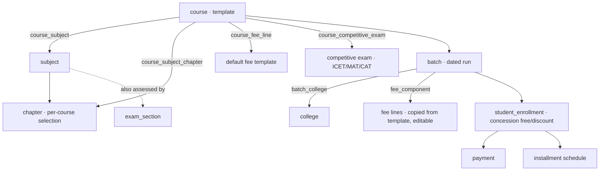
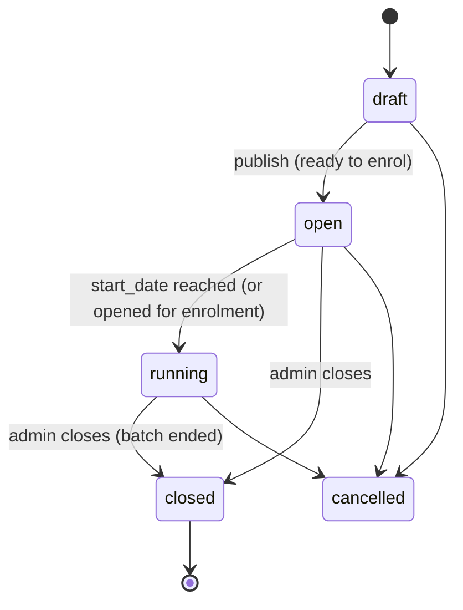

# Course Structure — Design (decisions locked)

**Status:** approved for build. Folds into `supabase/migrations/125_fees.sql`
(single migration, not yet deployed).

> **Update — the syllabus lives on the exam, not the course.** After building, we
> moved syllabus authoring off the course. A **Competitive Exam** (ICET, MAT,
> Bank PO… — table `competitive_exam`, UI name "Competitive Exams") is now a
> first-class entity that **owns its syllabus**: `competitive_exam_subject` +
> `competitive_exam_subject_chapter` (reusing the shared `subject`/`chapter`
> taxonomy). A **course inherits** its syllabus from the exams it targets
> (`course_competitive_exam`) — the course no longer has `course_subject` /
> `course_subject_chapter` (both dropped). This is where the "deeper for Bank,
> lighter for ICET" depth now lives — authored once per exam. Sections 2–3 below
> describing course-level subjects/chapters are superseded by this.

**Scope:** the *course → batch → students* structure, its subjects/chapters, its
dates, and the admin "close" action. Connects to the fee model (fee lines →
enrolment → payments/installments).

---

## The pattern

```
Course (reusable template: subjects + selected chapters + default fee)
   └── Batch (a dated run: optional start date, associated college(s), status)
          └── Students (enrolled into the batch) → payments / installments
```

- A **course** is a **template** defined once (its subjects, the specific
  **chapters** in scope, and a default fee structure). Editable later.
- A **batch** is one **run** of that course — its **dates**, **associated
  college(s)**, and **students**. Spin up **multiple batches per year**, typically
  one per college onboarded.
- **Free / discounted fees, full or installment payments** sit on each student's
  enrolment within a batch (from `125_fees.sql`).

> **"Close the course"** = **close the batch** (the batch has dates and ends).
> The course *template* is separately **archived** when retired.

---

## Locked decisions

| # | Decision |
|---|---|
| **Q1** | **Batch ↔ college is M:N** — a batch may serve one or several colleges. |
| **Q2** | **Subjects are shared** (the exam `subject` table), **but each course selects its own chapters** — e.g. a Bank course takes deeper chapters of Quant, an ICET course fewer. Modelled with `course_subject` + `course_subject_chapter`. |
| **Q3** | **Close is a manual admin action.** It **does not** auto-complete enrolments; balances **remain collectible** after close. |
| **Q4** | **Late enrolment allowed** while a batch is `running`. |
| **Q5** | **Dates are optional / open-ended** — a batch may set a `start_date`, `end_date` stays open until the admin closes it. |
| **Q6** | **Reuse the exam `subject` table** (and its `chapter`s). |
| **Q7** | **Each course associates to competitive exams** it prepares for (ICET, MAT, CAT, GATE, Bank…). A reference catalog (`competitive_exam`) linked M:N via `course_competitive_exam` — distinct from the platform's internal mock-exam entity. |

---

## Entity model



### 1. `course` — the template
`id, slug (unique), name, description, category, status (active|archived),
created_by, created_at, updated_at`. **No dates** — dates belong to a batch.

### 2. `course_subject` — subjects in the syllabus
`course_id → course`, `subject_id → subject`, `sort_order`, PK
(`course_id, subject_id`). Reuses the exam subject taxonomy.

### 3. `course_subject_chapter` — the per-course chapter selection
`course_id, subject_id, chapter_id`, PK (`course_id, subject_id, chapter_id`).
FK `(course_id, subject_id) → course_subject`, and `(chapter_id, subject_id) →
chapter(id, subject_id)` (so a chosen chapter must belong to that subject). This
is how the **same subject carries different depth per course** — mirrors the
exam `exam_section_chapter` pattern.

### 4. `course_fee_line` — default fee template
`course_id, label, amount_paise, sort_order`. **Defaults**: a new batch **copies**
these into its own fee lines and can then override — editing the template never
disturbs a running batch.

### 4b. `competitive_exam` + `course_competitive_exam` — associated exams
`competitive_exam` is a reference catalog (`code`, `name`, `sort_order`, `is_active`)
seeded with ICET / MAT / CAT / CMAT / GATE / BANK / SSC / GRE and extendable by
finance staff. `course_competitive_exam` (`course_id`, `competitive_exam_id`, PK both) links
a course to the exams it prepares students for (M:N). This is **distinct from the
platform's internal `exam`** (mock-test) entity — it names the *external* exam the
course targets, and is what drives the "deeper Quant for Bank, lighter for ICET"
chapter choices.

### 5. `batch` — a dated run
`id, course_id → course, name, code (unique), academic_year, delivery_mode
(online|offline|hybrid), start_date (nullable), end_date (nullable), currency
(default INR), status (draft|open|running|closed|cancelled), closed_at,
closed_by → app_user, created_by, created_at, updated_at`.

### 6. `batch_college` — associated colleges (M:N)
`batch_id → batch`, `college_id → college`, PK (`batch_id, college_id`).

### 7. `fee_component` — the batch's actual fee lines
`id, batch_id → batch, label, amount_paise, sort_order`. Seeded from
`course_fee_line` at batch creation, editable. Batch fee total = Σ components.
*(This folds in `125`'s `fee_plan`: pricing lives on the batch; `academic_year` +
`currency` move to the batch; the separate `fee_plan` table is dropped.)*

### 8. `student_enrollment` — students in a batch
References **`batch_id`** (course reachable via batch). Keeps `student_id`,
`college_id` (student's own college), `gross_fee_paise` (snapshot of the batch's
fee at enrolment), `concession_type` (`none`/`discount`/`scholarship`/`full_waiver`),
`concession_paise`, generated `net_fee_paise`, `payment_option`, `status`,
`enrolled_on`. → `payment` / `installment` / `enrollment_balance` unchanged.

---

## Batch lifecycle



| Batch status | Enrol | Payments | Meaning |
|---|---|---|---|
| `draft` | ✗ | ✗ | Being set up |
| `open` | ✓ | ✓ | Accepting enrolments |
| `running` | ✓ *(late enrol, Q4)* | ✓ | In progress |
| `closed` | ✗ | ✓ **on outstanding balances (Q3)** | Admin-closed; read-only |
| `cancelled` | ✗ | — | Called off |

**Close (admin, `finance.manage`):** `open`/`running` → `closed`; stamps
`closed_at` + `closed_by`; blocks new enrolments. **Enrolments are left as-is
(not auto-completed) and balances stay collectible.**

---

## Templating rules

- **Subjects & chapters** live on the **course**, shared by all its batches.
  A batch teaches whatever the course currently defines.
- **Fee** — `course_fee_line`s are **defaults**; a batch **copies** them into its
  own `fee_component`s at creation and may override.
- **Price is frozen again at enrolment** (`gross_fee_paise` snapshot), so editing
  a batch's fee later never changes what an already-enrolled student owes.

---

## Illustrative example

> **Course (template):** "Placement Readiness Program" — subjects Quant / Logical
> Reasoning / Verbal / Core CS, each with a chosen set of chapters; default fee
> Tuition ₹18,000 + Certification ₹2,000.
>
> **Batch:** "SVEC · Aug 2026" (`PRP-SVEC-2608`), hybrid, associated college SVEC,
> start 2026-08-01 (no fixed end), fee copied from template (₹20,000, editable).
> SVEC students enrol here; a parallel "ABC College" batch runs the same course.
>
> A student with a ₹2,000 scholarship owes ₹18,000, paid in two installments.
> When SVEC's cohort finishes, the admin **closes that batch**; ABC's keeps
> running; a student still carrying a balance can keep paying.

---

## Build plan (folds into `125_fees.sql`)

1. `course` → template (`status active/archived`, no dates).
2. Add `course_subject`, `course_subject_chapter`, `course_fee_line`,
   `competitive_exam` (+ seed) & `course_competitive_exam`, `batch`, `batch_college`.
3. Move `fee_component` onto `batch`; **drop `fee_plan`**; `academic_year` +
   `currency` on the batch.
4. `student_enrollment` → `batch_id`.
5. RLS: catalog (course/subjects/chapters/fee lines/batch/batch_college) readable
   by signed-in users, writable by `finance.manage`; enrolment/payment/installment
   as designed (student self-read; finance write; college staff read-only).

Downstream phases: **Courses admin** (template + subjects/chapters + default fee),
**Batches admin** (create from course, associate colleges, dates, tweak fee,
**Close batch**), enrolment, then the receipt rewire.
